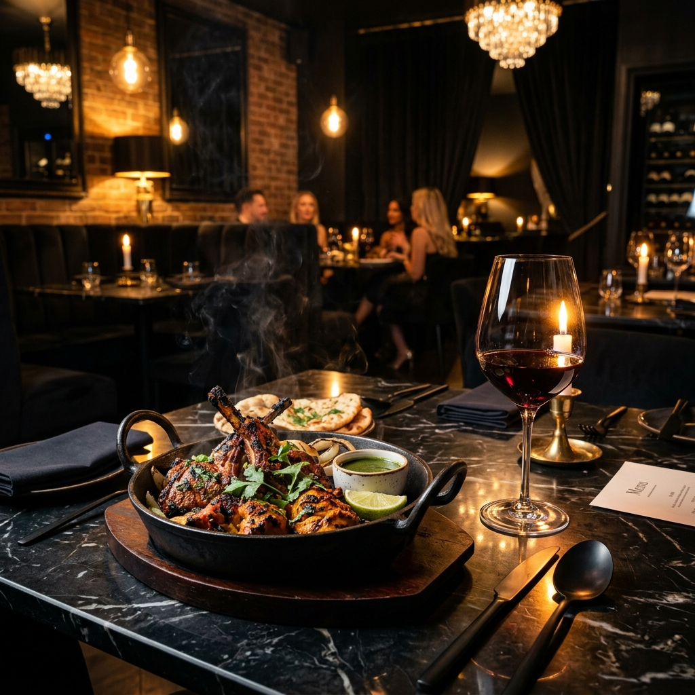

# Kashmir Palace — Luxury Fine Dining Landing Page



A luxury fine dining web application for **Kashmir Palace** (Restaurant Indien & Pakistanais — Belfort), crafted with a high-end black & gold visual design system inspired by Michelin-star digital experiences.

---

## ✨ Features

- 👑 **Royal Design System**: Midnight obsidian background (`#08090D`) with polished gold accents (`#D4AF37`).
- 🥗 **Separated Category Carte**: 84 authentic Indian & Pakistani dishes organized into distinct visual category blocks (*Entrées & Beignets, Tandoori & Grillades, Plats Principaux, Crevettes & Poissons, Légumes Végétariens, Biryanis, Naans, Desserts*).
- 🔍 **Live Search & Filter Toolbar**: Search any dish, naan, curry, or ingredient in real time.
- 📱 **Mobile First & Responsive**: Touch-scrollable category tabs ribbon and full-screen glassmorphism mobile menu drawer.
- 📅 **Interactive Reservation Form**: Online table booking system with confirmation modal and toast notifications.
- 📸 **Culinary Gallery**: High-resolution dish photography lightbox.
- 📍 **Local SEO & Schema.org**: Fully optimized JSON-LD for Google rich snippets and search ranking.

---

## 🛠️ Project Structure

```
.
├── index.html                # Semantic HTML5 & Schema.org JSON-LD
├── assets/
│   ├── css/
│   │   └── style.css         # Custom CSS Design Tokens & Media Queries
│   ├── js/
│   │   └── main.js           # Menu Dataset, Filtering, Search & Modal Handlers
│   └── images/               # High-Resolution Culinary & Restaurant Media
└── README.md
```

---

## 🚀 Live Demo

Visit the live site: [https://owaisahmed19.github.io/kashmirPalace/](https://owaisahmed19.github.io/kashmirPalace/)
